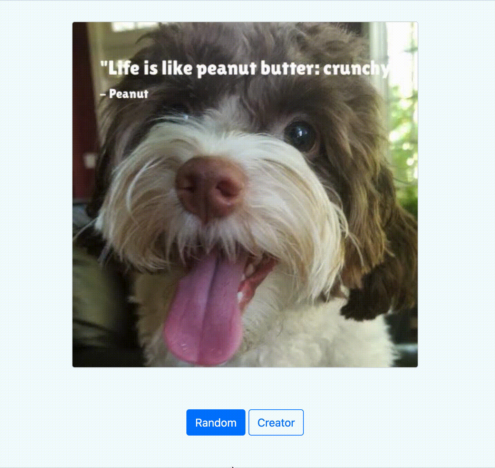

# Meme Generator

## Introduction

_Meme Generator project from Udacity's [Intermediate Python Nanodegree](https://www.udacity.com/course/intermediate-python-nanodegree--nd303)._





A simple meme generator with a CLI and a Flask powered web interface. The web interface supports two modes: random memes generated from a library of dog pictures and quotes and creating a meme from a picture, quote and author.


## Setup

### Download and install MemeGenerator
```sh
$ clone git https://github.com/clzuend/meme-generator.git
$ cd meme-generator
$ pip install -r requirements.txt
```

### Install pdftotext
```sh
$ sudo apt-get install -y xpdf
```


## Run

### Using CLI


```sh
$ python main.py --help
usage: main.py [-h] [-p PATH] [-b BODY] [-a AUTHOR]

options:
  -h, --help            show this help message and exit
  -p PATH, --path PATH  Path to image file.
  -b BODY, --body BODY  Quote body.
  -a AUTHOR, --author AUTHOR
                        Quote author.
```

Use the CLI to create a random meme in `./tmp`:
```sh
$ python3 main.py
```

Use the (optional) `-p`, `-a`, and `-b` flags to supply a custom image path, author, and quote body:
```
$ python3 main.py -p './_data/photos/dog/xander_1.jpg' -a 'Xander' -b 'Xander is a good dog!'
```


### Using Flask

Set up Flask to use `app.py`:
```sh
$ export FLASK_APP=app.py
```

Start the development server:
```sh
$ flask run
 * Serving Flask app 'app.py'
 * Debug mode: off
WARNING: This is a development server. Do not use it in a production deployment. Use a production WSGI server instead.
 * Running on http://127.0.0.1:5000
Press CTRL+C to quit
```

Open the web interface at http://127.0.0.1:5000 once the server is running.


## Modules

The project consists of two main modules: the `QuoteEngine` and the `MemeEngine`.

### QuoteEngine
The `QuoteEngine` consists of a simple `QuoteModel` class to represent quotes, with attributes for their author and body.

```python
class QuoteModel():
    """
    A class to represent quotes.
    
    Attributes:
        body : str -- text body of the quote
        author : str -- author of the quote
    """
    def __init__(self, body:str, author:str):
        """Create a new quote"""
        self.body = body.strip('"')
        self.author = author
```

The `IngestorInterface` class and its subclasses implement a framework for strategies to ingest quotes from files in different formats:

```python
class IngestorInterface(ABC):
    """
    An abstract class representing the Ingestor strategy.
    
    Attributes:
        allowed_extensions : List -- allowed extensions (overwritten)
        
    Methods:
        can_ingest(path) -- Test if document can be ingested.
        parse(path) -- Parse the document and ingest to QuoteModel.
    """
```

### MemeEngine

The `MemeEngine` class represents the factory for the `make_meme()` method which turns an image, text and author into a meme using formatting specified by the attributes of the `MemeEngine`:


```python
class MemeEngine():
    """
    A class to represent the MemeEngine.
    
    Main attributes:
        base_path: str -- Base path to save memes
        fnt_path: str -- Path to font
        fnt_size: str -- Maximum font size for quote (might get scaled smaller)
        max_words: str -- Maximum number of words per line for quote
        padding: str -- Padding between text and image boarder as a fraction
        gap: str -- Gap between quote body and author in pixels
    
    
    Main methods:
        make_meme(img_path, text, author, width=500) -- Create meme from image, text and author.
    """
    
    def __init__(self, base_path: str='./static', 
                 fnt_path: str='./fonts/LilitaOne-Regular.ttf', fnt_size: int=40,
                 max_words: int=6, padding: float=0.05, gap: int=10):
        """
        Initialize a new MemeEngine.
        
        Arguments:
            base_path: str -- Base path to save memes
            fnt_path: str -- Path to font
            fnt_size: str -- Maximum font size for quote (might get scaled smaller)
            max_words: str -- Maximum number of words per line for quote
            padding: str -- Padding between text and image boarder as a fraction
            gap: str -- Gap between quote body and author in pixels
        """
        self.base_path = base_path
        self.fnt_path = fnt_path
        self.fnt_size = fnt_size
        self.max_words = max_words
        self.padding = padding
        self.gap = gap

    def make_meme(self, img_path: str, text: str, author: str, width: int=500) -> str:
        """
        Create a meme from an image, text and author.
    
        Arguments:
            img_path: str -- path to the input image
            text: str -- text body of the quote
            author: str -- author of the quote
            width: int -- width of output image (defaul=500)
    
        Returns:
            out_path : str -- the file path to the output image
        """  
```


